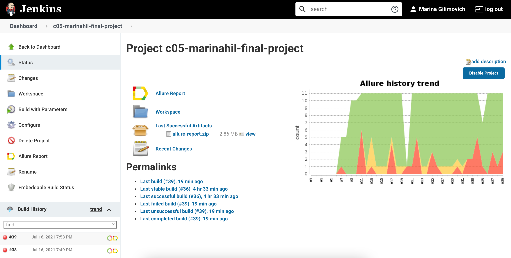
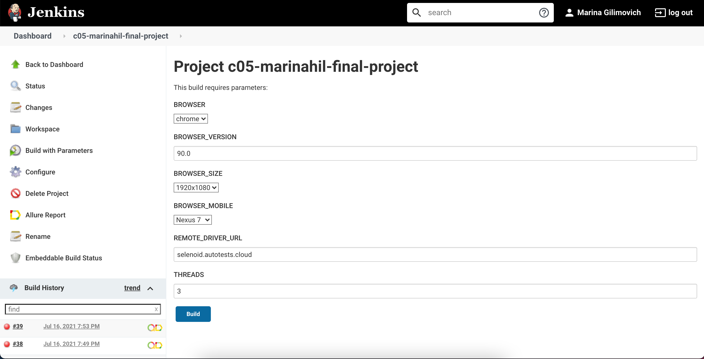
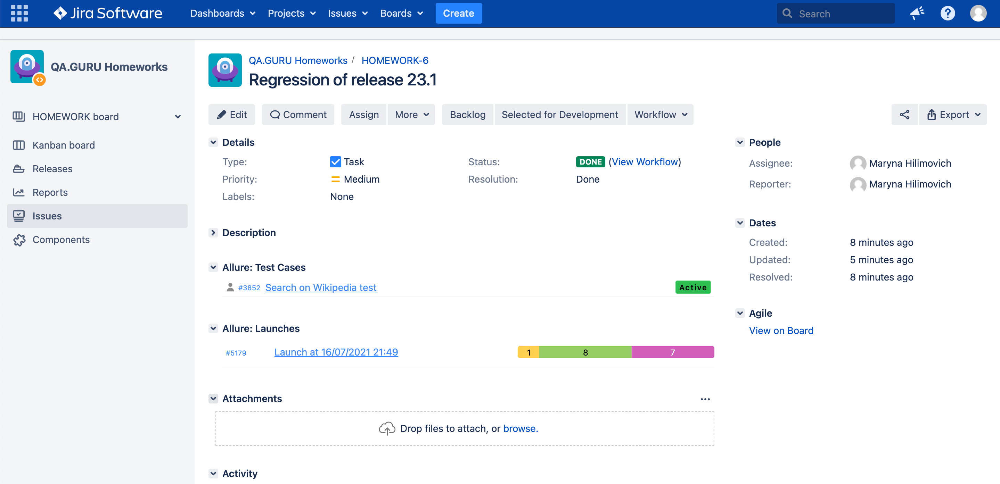
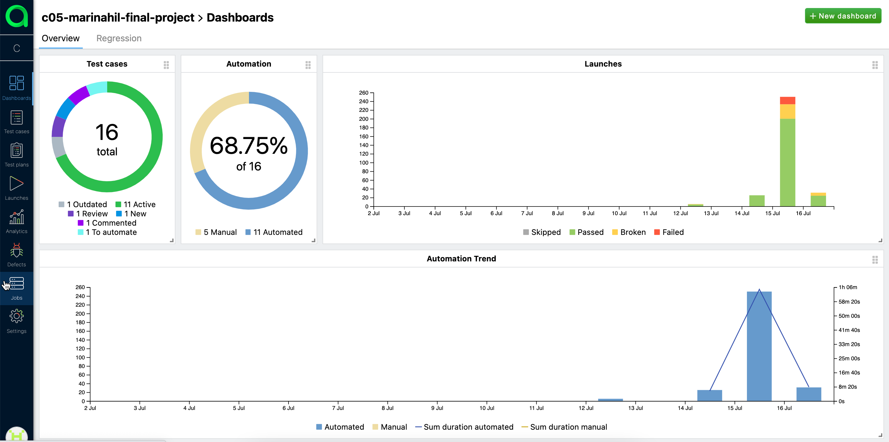
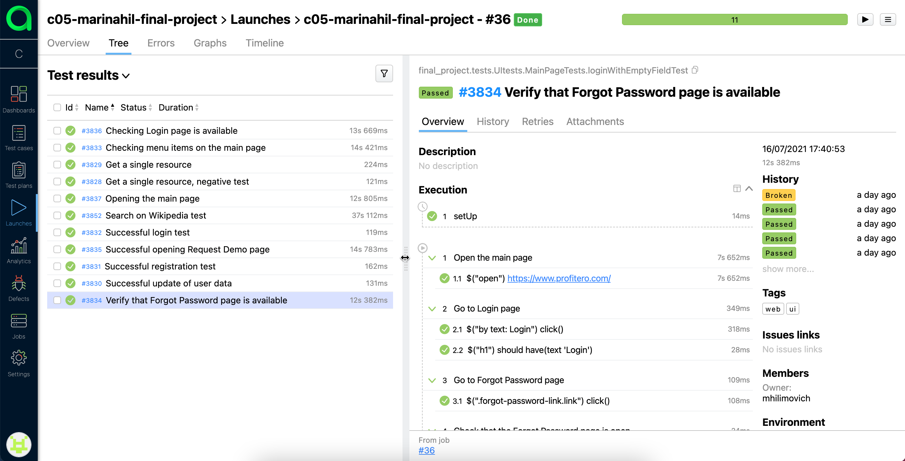
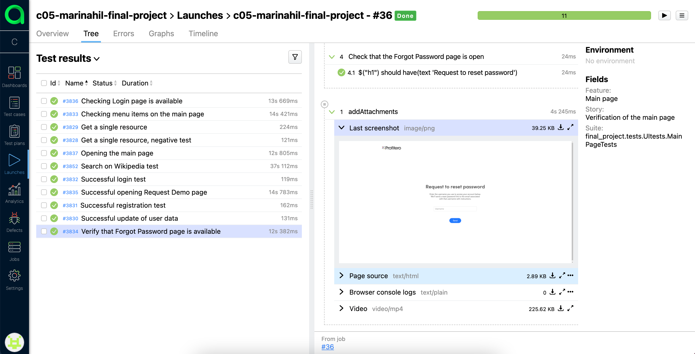
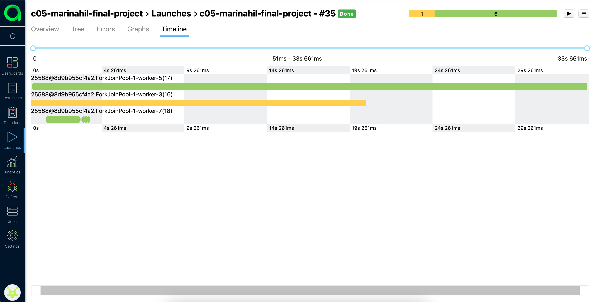
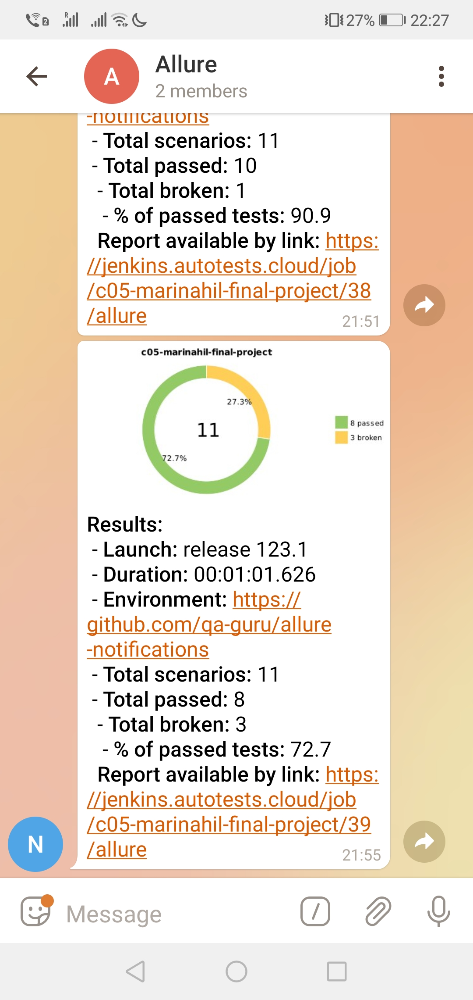

## The examples of UI, API and Mobile tests:
- UI tests for [Profitero](https://www.profitero.com) web-site
- API tests for [Reqres](https://reqres.in/) web-site
- Mobile tests for Wikipedia android application

### Used technologies:

`Java` `Junit5` `Selenide` `Gradle` `Selenoid` `Jenkins` `Allure Report` `Telegram Bot`

### [Jenkins](https://jenkins.autotests.cloud/job/c05-marinahil-final-project/) project:
Run Builds Statistics

Parameters Configuration

### [Jira](https://jira.autotests.cloud/browse/HOMEWORK-6) integration:

### [Allure](https://allure.autotests.cloud/project/261/dashboards) report:

   

   

Parallel Tests Execution

### Video of a running test:

### Telegram notification:

